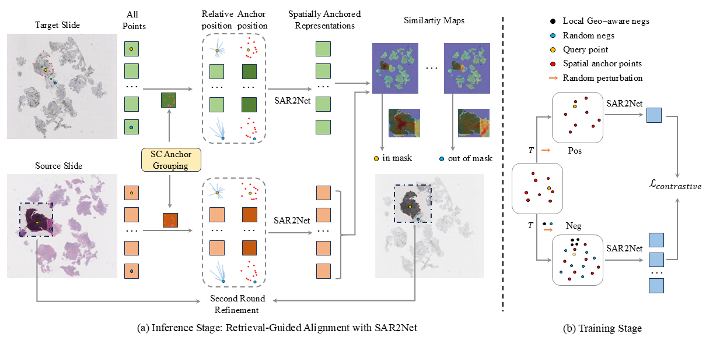

# SAR2Net: Learning Spatially Anchored Representations for Retrieval-Guided Cross-Stain Alignment

<!-- Insert a pipeline of your algorithm here if got one -->
<div align="center">
    <a href="https://"></a>
</div>

## Main Requirements
> torch
> 
> torchvision
> 
> opencv-python
> 
> openslide
> 
> opensdpc

## Training
The SAR2Net use no real slides for training and relies solely on simulated coordinates.

To train the model
```python
cd train
python train_kneg_big_new.py --device cuda:0 --save_dir ../checkpoints --batch_size 256 --train_num 102400000 --lr 0.0001 --model_temp 1 --k_neg 500 --neg_delta 20 --loss_mode infonce --loss_temp 0.4 --out_dim 256 --save_every 5000 --attn_fc --img_size 400 --max_rot 90 --min_rot 10 --r_rot 0.9 --r_site 0.1 --max_ref_num 10 --pertu 3
```

## Inference
For the first stage only,
```python
python ./inference/run.py --save_dir your_dir --model_name your_model_name --attn_fc --step 205000 --batch_size 256 --loss_mode infonce --out_dim 256 --select_point close --temperature 1 --top_k 5 --low_thre 0.7 --num_p 15 --patch_size 100 --stride 50 --machine 19 --t_f_mode trident --split_mode ransac_rigid --dist_thre 10 --merge_points --patch_ratio 2 --set_ori --r_rot 0.9 --r_site 0.1 --multi_anchor --s_expand --device cuda:0 
```
For the second stage, use
```python
--second_round
```


**More Details can be found in our later released paper!**

